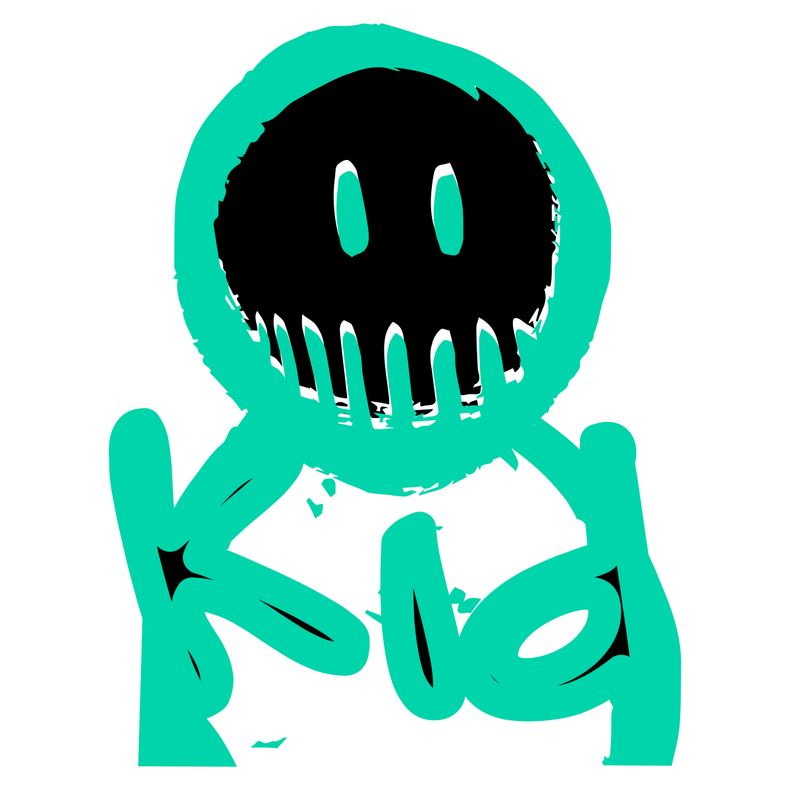

# InputKid

###### Addon for Godot Engine 4.2

InputKid is a companion add-on to [UIKid](https://github.com/from-the-forest/ui-kid) with a focus on common game and application input handling requirements for Godot Engine 4.2+ projects. 

It is a playful and creative (also very sparse) bunch of tools designed to help you create fun and chaos through user interaction. Designed with the intention of seamlessly working with UI text Control nodes freely without needing to extend via inheritance or reimplement specific behaviours again and again. This ensures you are free to use standard Control nodes and/or extend your own subclassed Controls. It should even work with completely bespoke controls that provide the same interface as the Godot Engine versions. You use InputKid's scripts or nodes when required without adding additional complexity to your project. 

Both InputKid and UIKid can be included independently. InputKid is currently in its early stages, so expect some rough edges. If you're looking for a serious, turn-key input handling module for your Godot Engine projects this might not be for you. At least not yet. If you're ready to experiment in spaces of play and have some fun for no other reason than fun, welcome to the InputKid dimension!

The root folder contains a [project.godot](project.godot) file meant to be used with [Godot Engine](https://godotengine.org), the open source 2D and 3D game engine.

I have provided a [demo.tscn](demo.tscn) to showcase InputKid's capabilities.

## What's Inside?

#### TEXT FILTERS `/text/filters/`

###### See [TextFilter Documentation](addons/input_kid/text/filters/text_filter.md) for further details on extending TextFilter

- _[sample]_ **[HardCharacterLimitFilter](addons/input_kid/text/filters/hard_character_limit_filter.gd) :** Inhereted from **TextFilter**. Provides a hard character limit on input received by affected UI text control. Rejects input if character limit is exceeded.

  `@export var character_limit: int = 10` 

- _[sample]_ **[SoftCharacterLimitFilter](addons/input_kid/text/filters/soft_character_limit_filter.gd) :** Inhereted from **TextFilter**. Provides a soft character limit on input received by affected UI text control. Accepts input if character limit is exceeded but is accepted invalid.

  `@export var character_limit: int = 10`

- _[sample]_ **[MaxLineLimitFilter](addons/input_kid/text/filters/hard_character_limit_filter.gd) :** Inhereted from **TextFilter**. Provides a maximum line limit on input received by affected UI text control.

  `@export var line_limit: int = 10`

- _[sample]_ **[DebugFilter](addons/input_kid/text/filters/debug_filter.gd) :** Inhereted from **TextFilter**. Sample InputFilter that prints the text currently captured by **TextInputCaptor** and the `_input(event: InputEvent)` information to the output console using **TextFilter**'s `pre_filter_text` signal.

- _[abstract]_ **[TextFilter](addons/input_kid/text/filters/text_filter.gd) :** Inhereted from **TextInputAuthority**. Provides input filtering capabilities for various UI text controls. It allows you to create custom filters to validate, modify, or reject user input before it's applied to the control's text property.

#### TEXT INPUT `/text/`

- **[TextInputAuthority](addons/input_kid/text/text_input_authority.gd) :** Inhereted from **TextInputCaptor**. Provides a consistent pattern for accepting or rejecting control input text and then issuing relevant signals or override logic.
- **[TextInputCaptor](addons/input_kid/text/text_input_captor.gd) :** Inhereted from **TextInputAffector**. Offers a consistent pattern for capturing control input text and then releasing it to be consumed by the control.
- **[TextInputAffector](addons/input_kid/text/text_input_affector.gd) :** Mechanism for attaching parasitic overrides to text-based controls.

#### PROJECT ROOT `/`

- _[abstract]_ **[Affector](addons/input_kid/affector.gd) :** Abstract mechanism for attaching parasitic overrides to Control.

## Encountering Problems?

As with UIKid, you should expect to encounter issues when incorporating InputKid in your Godot Engine Project. This is your reward for being an early-adopter, and You don't get to be THE early-adopter without losing a couple of teeth and spending a few nights in rehab as a result. Sorry and thank-you.

Please feel free to create a GitHub issue or submit a PR to the repo, It'll be fun for both of us!

## License

This Godot Engine Plugin (InputKid Add-on) is distributed under the terms of the MIT license, as described in the [LICENSE file](LICENSE) file.

